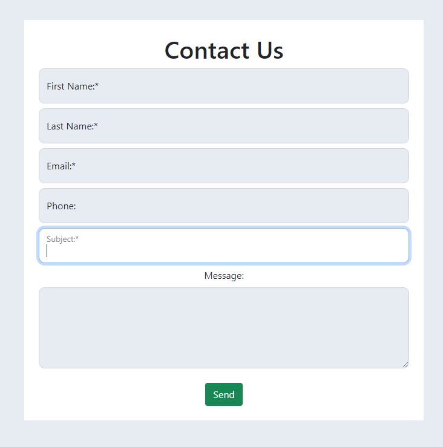

# How to style forms in Django using Widget Tweaks

In this article, we are going to explore how to utilise the power of Widget Tweaks to style our forms in Django. If you have previous experience with Django you probably know that our forms need additional work in order to be styled as desired. We are going to set up a simple Contact Us form for our example and implement floating labels with the help of Bootstrap 5 and the package Widget Tweaks.

##### What is Django Widget Tweaks?

Widget Tweaks is a package that provides additional functionalities and features for working with form widgets and rendering in Django templates. It is not a part of the Django core framework but is instead a third-party package that extends Django's capabilities. It allows us to modify forms directly in our templates.

We are assuming that you know how to set up a Django project. Let's have a look at the code so far. We have created a new app called Contact which is where the majority of our code is going to live.

##### The model

In our `models.py` file we have the following fields:

```
from Django.db import models


class Contact(models.Model):
    first_name = models.CharField(max_length=200, blank=False, null=True)
    last_name = models.CharField(max_length=200, blank=False, null=True)
    email = models.EmailField(max_length=300, blank=False, null=True)
    phone = models.CharField(max_length=100, blank=True, null=True)
    subject = models.CharField(max_length=200, blank=False, null=False)
    message = models.TextField()

    def __str__(self):
        return self.subject
```

##### Create a form from our model

Create a file called `forms.py` and define the `ContactForm` class

```
from Django.forms import ModelForm
from .models import Contact


class ContactForm(ModelForm):
    class Meta:
        model = Contact
        fields = '__all__'
```

##### Render the form

In our `views.py` file we are going to create a function that will render our template and pass in the form to the template.

```
from Django.shortcuts import render
from .forms import ContactForm


def contact(request):
    form = ContactForm()

    context = {'form': form}
    return render(request, 'contact/contact.html', context)
```

##### The template

Now let's see what results we get if we render the form as standard. Please note that we are using Bootstrap 5 in this template.

```
    <section class="contact">
        <div class="container">
            <div class="row justify-content-center">
                <div class="col-10 text-center my-5 p-4 shadow-container">
                    <h1>Contact Us</h1>
                    <form method="POST">
                        
                        {{form}}
                        <div class="form-group">
                            <button type="submit" class="btn btn-success">Send</button>
                        </div>
                    </form>
                </div>
            </div>
        </div>
    </section>
```

As you can see the results require some styling. If you are using an older version of Django the results may appear slightly different.


#### Setting up Django Widget Tweaks

1. To set up Widget Tweaks, first we need to install the package by running `pip install django-widget-tweaks` in our terminal.

2. To enable widget_tweaks in our project we need to add it to `INSTALLED_APPS` in our project's `settings.py` file:

```
INSTALLED_APPS = [
    # your apps
    'widget_tweaks',
]
```
3. Load the package into our template by adding `` at the top of the `contact.html` file.
We are now ready to use Widget Tweaks for our form.

##### Using Widget Tweaks

1. Rendering a field and adding a class

The syntax is very simple, we want to render a field from our form, called first_name and then we add the class.

```
<label for="id_first_name">First Name:*</label>

```

This will return the following HTML

```
<label for="id_first_name">First Name:*</label>
<input type="text" name="first_name" maxlength="200" class="form-control" required id="id_first_name">
```
2. Adding an attribute

It is very simple to add an attribute just by adding `|attr:""`

```
<label for="id_first_name">First Name:*</label>

```

This is the HTML output and as you can see the title is present.

```
<label for="id_first_name">First Name:*</label>
<input type="text" name="first_name" maxlength="200" class="form-control" title="Hello, world!" required id="id_first_name">
```

3. Looping through the fields

We can loop through all of the fields in a form and add the required class and attribute as in the example below. We are also rendering errors specific to the field.

```


<div class="form-floating mb-4">
    {{ field|add_class:'form-control'|attr:'placeholder = field.label.text' }}
    <label for="{{ field.id_for_label }}">{{ field.label }}</label>

    
    <span class="text-danger">{{ error }}</span>
    
</div>


```

4. Rendering Errors

- Field-related errors. Using this syntax when rendering a field allows us to visually display the error close to the field itself.

```

<span class="text-danger">{{ error }}</span>

```

- Rendering general form errors
Sometimes we may need to catch generic errors like 'Too Many Login Attempts'. Just add this to the end of the form.
```
  
  <div>
    <span class="text-danger"> {{ form.non_field_errors  }}</span>
  </div>
  
```

5. Rendering hidden fields. 

Sometimes we need to include data that is not displayed to the user but is sent along with the form submission and this is where hidden fields come in handy. To render hidden fields, use the below example.

```

{{ hidden }}

```

#### Floating Label Form Rendering.

Now with this knowledge, let's finish our form. We will be using the Bootstrap 5 syntax, which means we need to render our field first before the label. The field must have a `form-floating` class and a placeholder for this to work. For greater control, we are going to render each field rather than looping through.

```
 <form method="POST">
                    
                    <!-- If any hidden fields -->
                    
                    {{ hidden }}
                    
                    <!-- end -->

                    <div class="form-floating mb-2">
                        
                        <label for="id_first_name">First Name:*</label>
                        <!-- Rendering field errors -->
                        
                        <span class="text-danger">{{ error }}</span>
                        
                    </div>

                    <div class="form-floating mb-2">
                        
                        <label for="id_last_name">Last Name:*</label>
                        <!-- Rendering field errors -->
                        
                        <span class="text-danger">{{ error }}</span>
                        
                    </div>

                    <div class="form-floating mb-2">
                        
                        <label for="id_email">Email:*</label>
                        <!-- Rendering field errors -->
                        
                        <span class="text-danger">{{ error }}</span>
                        
                    </div>

                    <div class="form-floating mb-2">
                        
                        <label for="id_phone">Phone:</label>
                        <!-- Rendering field errors -->
                        
                        <span class="text-danger">{{ error }}</span>
                        
                    </div>

                    <div class="form-floating mb-2">
                        
                        <label for="id_subject">Subject:*</label>
                        <!-- Rendering field errors -->
                        
                        <span class="text-danger">{{ error }}</span>
                        
                    </div>

                    <div class="form-group mb-4">
                        <label for="id_message" class="form-label">Message:</label>
                        
                        
                        <span class="text-danger">{{ error }}</span>
                        
                    </div>

                    <!-- Rendering Generic Form Errors -->
                    
                    <div>
                        <span class="text-danger"> {{ form.non_field_errors }}</span>
                    </div>
                    

                    <div class="form-group">
                        <button type="submit" class="btn btn-success">Send</button>
                    </div>
                </form>
```

This is the final result.



You can find more information about the package [here](https://pypi.org/project/django-widget-tweaks/) and [GitHub Repo](https://github.com/jazzband/django-widget-tweaks)
If you want to check the code used in this article click [here](https://github.com/Dayana-N/django-widget-tweaks-article)