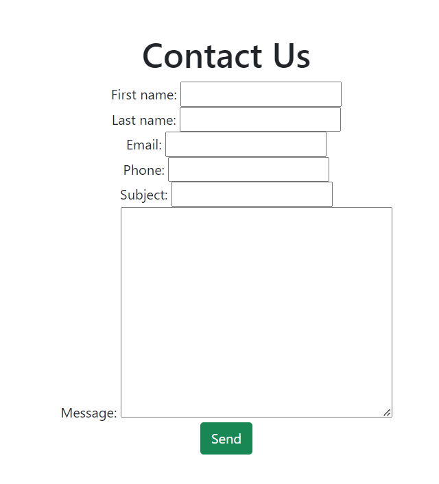

# django-widget-tweaks-article
Django Widget Tweaks article

How to style forms in Django using Widget Tweaks

In this article we are going to explore how to utilise the power of widget tweaks to style our forms in Django. If you have previous experience with Django you probably know that our forms need additional work in order to be styled as desired. We are going to setup a simple Contact Us form for our example.

We are assuming that you know how to setup a Django project. Let's have a look at the code so far.

We have created a new app called Contact which is where the majority of our code is going to live.

##### The model

In our `models.py` file we have the following fields:

```
from django.db import models


class Contact(models.Model):
    first_name = models.CharField(max_length=200, blank=False, null=True)
    last_name = models.CharField(max_length=200, blank=False, null=True)
    email = models.EmailField(max_length=300, blank=False, null=True)
    phone = models.CharField(max_length=100, blank=True, null=True)
    subject = models.CharField(max_length=200, blank=False, null=False)
    message = models.TextField()

    def __str__(self):
        return self.subject
```

##### Create a form from our model

Create a file called `forms.py` and define the `ContactForm` class

```
from django.forms import ModelForm
from .models import Contact


class ContactForm(ModelForm):
    class Meta:
        model = Contact
        fields = '__all__'
```

##### Render the form

In our `views.py` file we are going to create a function which will render our template and pass in the form to the template.

```
from django.shortcuts import render
from .forms import ContactForm


def contact(request):
    form = ContactForm()

    context = {'form': form}
    return render(request, 'contact/contact.html', context)
```

##### The template

Now let's see what results we get if we render the form as standart.

```
<body>
    <h1>Contact Us</h1>
    {{form}}
</body>
```

As you can see the results require some styling. 



#### Django Widget Tweaks
Widget Tweaks is a package that provides additional functionalities and features for working with form widgets and rendering in Django templates. It is not a part of the Django core framework but is instead a third-party package that extends Django's capabilities.

To setup Widget Tweaks, first we need to install the package by running `pip install django-widget-tweaks`

To enable widget_tweaks in our project we need to add it to INSTALLED_APPS in our project's settings.py file:

```
INSTALLED_APPS = [
    # your apps
    'widget_tweaks',
]
```